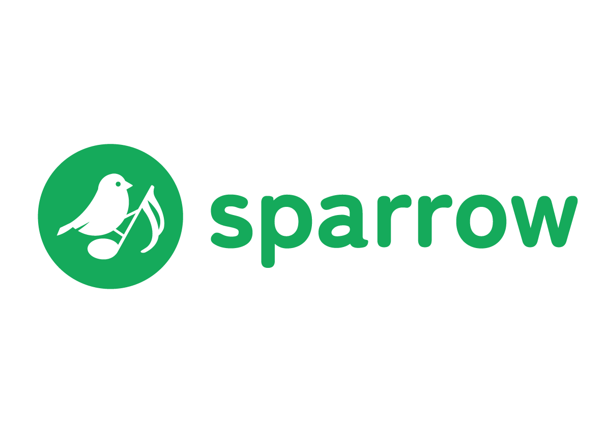

 
 

<h1> SQL </h1>
<a href="./Database/Music_Db.sql">Music_Db SQL file</a>
 
<a href="./Database/User_Db.sql">User_Db SQL file</a>

 
 

 

 
 

<h1> Migration </h1>
1)Add-Migration SparrowContextMigration1 -Context Sparrow.Persistence.Contexts.MusicDbContext.Music_DbContext
 
2)update-database -Context Sparrow.Persistence.Contexts.MusicDbContext.Music_DbContext

 
 

1)add-migration SparrowContextMigration2 -Context Sparrow.Persistence.Contexts.UserDbContext.User_DbContext
 
2)update-database -Context Sparrow.Persistence.Contexts.UserDbContext.User_DbContext

 
 
<h1> MSSQL Server </h1>
docker run -e "ACCEPT_EULA=Y" -e "MSSQL_SA_PASSWORD=admin1234@" -p 1430:1433 --name sql2 --hostname sql2 -d ` mcr.microsoft.com/mssql/server:2022-latest 

 
 

<h1> PostgreSQL </h1>
docker run --name some-Logpostgres -p 5432:5432 -e POSTGRES_USER=postgres -e POSTGRES_PASSWORD=postgres -e POSTGRES_DB=Interview_LogDB -d postgres:15.4

 
 

<h1 style="color: red;"> Redis </h1>

 docker run -d --name some-redis -p 6379:6379 redis:latest --requirepass redis 

 Username: default 

 Password: redis 

 
 

<h1> Azure Blob Storage </h1>
docker run -p 10000:10000 -p 10001:10001 -p 10002:10002 mcr.microsoft.com/azure-storage/azurite azurite --blobHost 0.0.0.0 --skipApiVersionCheck

Microsoft Azure Storage Explorer -> Local Storage Emulator (Display name: Interview)

Connection string:   AccountName=devstoreaccount1;AccountKey=Eby8vdM02xNOcqFlqUwJPLlmEtlCDXJ1OUzFT50uSRZ6IFsuFq2UVErCz4I6tq/K1SZFPTOtr/KBHBeksoGMGw==;DefaultEndpointsProtocol=http;BlobEndpoint=http://127.0.0.1:10000/devstoreaccount1;QueueEndpoint=http://127.0.0.1:10001/devstoreaccount1;TableEndpoint=http://127.0.0.1:10002/devstoreaccount1; 

 
 

<h1> Seq log server </h1>
docker run --name seq -d --restart unless-stopped -e ACCEPT_EULA=Y -e SEQ_PASSWORD=1234 -p 5341:80 datalust/seq:latest

  

username: admin 
 
password: 1234

